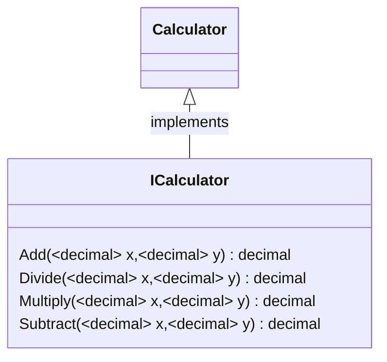
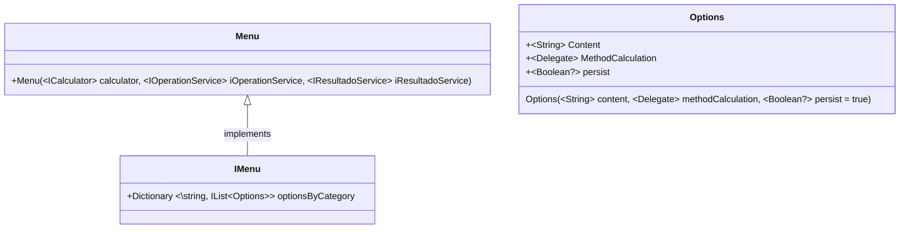
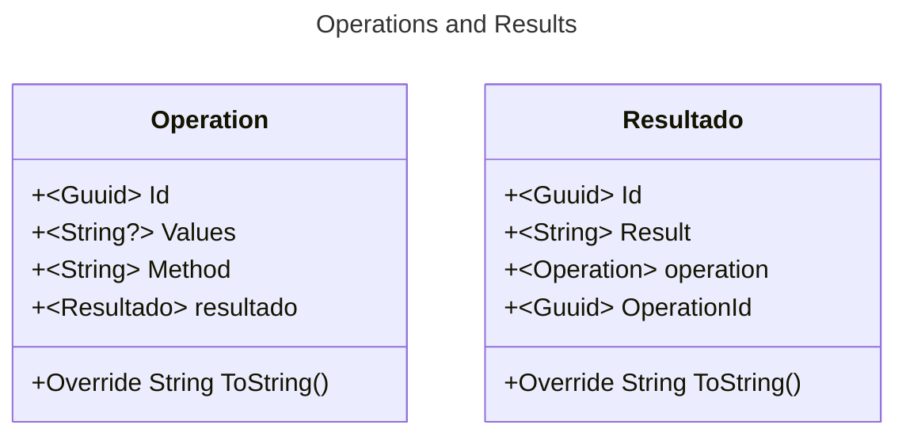
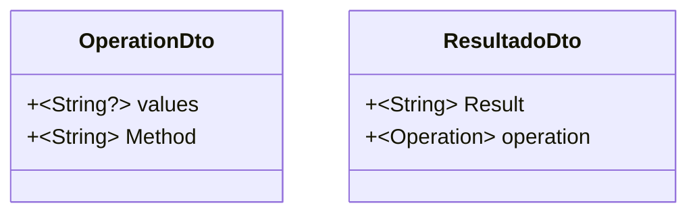
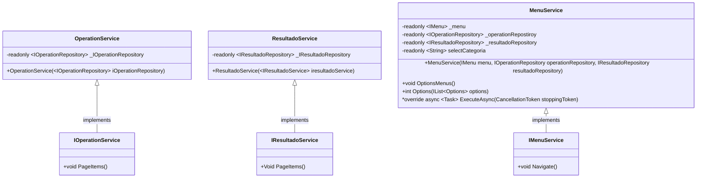
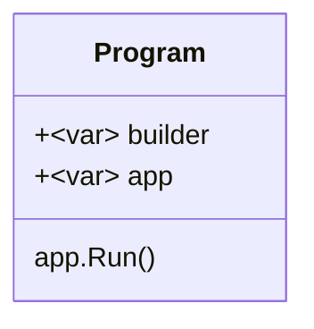
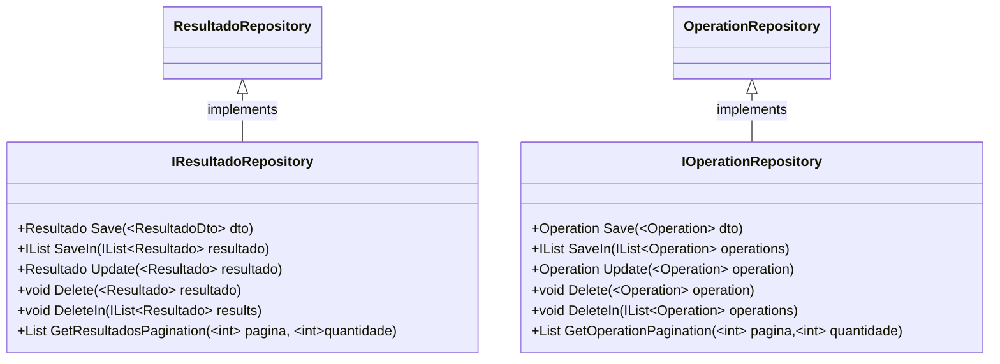
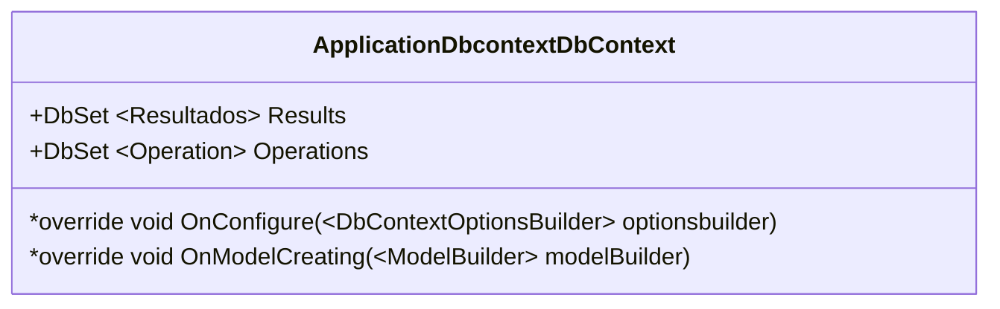

<h1>Model</h1>

```mermaid
classDiagram
    Calculator <|--  ICalculator : implements
    graph LR
    class Calculator {
        
    }  
    class ICalculator {
        Add(~decimal~ x,~decimal~ y) decimal
        Divide(~decimal~ x,~decimal~ y) decimal
        Multiply(~decimal~ x,~decimal~ y) decimal
        Subtract(~decimal~ x,~decimal~ y) decimal
    }
    
```
 
 
 

```mermaid

    
    classDiagram
    Menu <|-- IMenu : implements
    Graph LR
       class IMenu{
       +Dictionary <\string, IList~Options~\> optionsByCategory
       }
        class Menu{
        +Menu(~ICalculator~ calculator, ~IOperationService~ iOperationService, ~IResultadoService~ iResultadoService)
       }
       class Options{
        +~String~ Content
        +~Delegate~ MethodCalculation
        +~Boolean?~ persist
        Options(~String~ content, ~Delegate~ methodCalculation, ~Boolean?~ persist = true)
       }
       

```
 
 
 

```mermaid

 ---
title: Operations and Results
---
    classDiagram
    class Operation{
        +~Guuid~ Id
        +~String?~ Values
        +~String~ Method
        +~Resultado~ resultado
        +Override String ToString()
       }
       
       class Resultado{
        +~Guuid~ Id
        +~String~ Result
        +~Operation~ operation
        +~Guuid~ OperationId
        +Override String ToString()
       }
```

 
 
 
<h1>DTO</h1>

```mermaid

    
    classDiagram
      
        class OperationDto{
           +~String?~ values
           +~String~ Method 
       }
         class ResultadoDto{
            +~String~ Result
            +~Operation~ operation
       }
      

```
<h1>Services</h1>

```mermaid
 
    classDiagram
    
      class OperationService{
        -readonly ~IOperationRepository~ _IOperationRepository
        +OperationService(~IOperationRepository~ iOperationRepository)
      }   
      OperationService  <|-- IOperationService : implements  
      class IOperationService{
        +void PageItems()
      }
    
    class ResultadoService{
        -readonly ~IResultadoRepository~ _IResultadoRepository
        +ResultadoService(~IResultadoService~ iresultadoService)
    }
    ResultadoService <|-- IResultadoService : implements
    class IResultadoService{
        +Void PageItems()
    }

    
    class MenuService{
      -readonly ~IMenu~ _menu
      -readonly  ~IOperationRepository~ _operationRepostiroy
      -readonly ~IResultadoRepository~ _resultadoRepository
      -readonly ~String~ selectCategoria
      +MenuService(IMenu menu, IOperationRepository operationRepository, IResultadoRepository resultadoRepository)
      +void OptionsMenus()
      +int Options(IList~Options~ options)
      *override async ~Task~ ExecuteAsync(CancellationToken stoppingToken)
    }  
    MenuService <|-- IMenuService : implements
    class IMenuService{
      +void Navigate()
    }

```

<h1>Program<h1>

```mermaid
    
classDiagram
    
    class Program{
       +~var~ builder
       +~var~ app
       app.Run()
    }
```
 
 
 
<h1>Repository</h1>

```mermaid

    
classDiagram
    ResultadoRepository <|--  IResultadoRepository : implements
    class ResultadoRepository{ 
    }
    class IResultadoRepository{
        +Resultado Save(~ResultadoDto~ dto)
        +IList<Resultado> SaveIn(IList~Resultado~ resultado)
        +Resultado Update(~Resultado~ resultado)
        +void Delete(~Resultado~ resultado)
        +void DeleteIn(IList~Resultado~ results)
        +List<Resultado> GetResultadosPagination(~int~ pagina, ~int~quantidade)
        
    }
    OperationRepository <|--  IOperationRepository : implements
    class OperationRepository{
    }

    class IOperationRepository{
        +Operation Save(~Operation~ dto)
        +IList <Operation> SaveIn(IList~Operation~ operations)
        +Operation Update(~Operation~ operation)
        +void Delete(~Operation~ operation)
        +void DeleteIn(IList~Operation~ operations)
        +List <Operation> GetOperationPagination(~int~ pagina,~int~ quantidade)
        
    }

```
 
 
 
<h1>Infrastructure</h1>

```mermaid
classDiagram
    class ApplicationDbcontext DbContext{
        +DbSet ~Resultados~ Results
        +DbSet ~Operation~ Operations
        *override void OnConfigure(~DbContextOptionsBuilder~ optionsbuilder)
        *override void OnModelCreating(~ModelBuilder~ modelBuilder)
    }
```

 
       
       