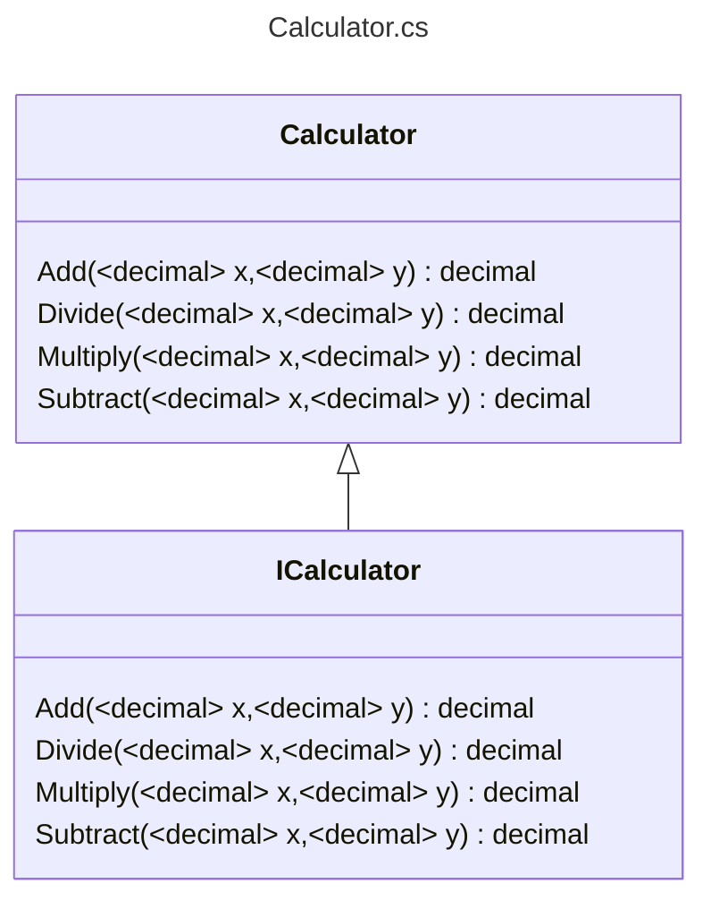
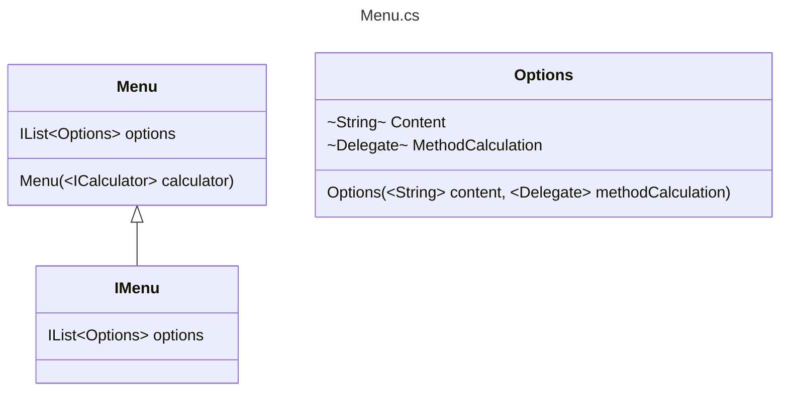
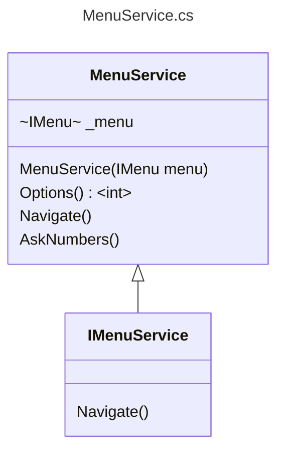
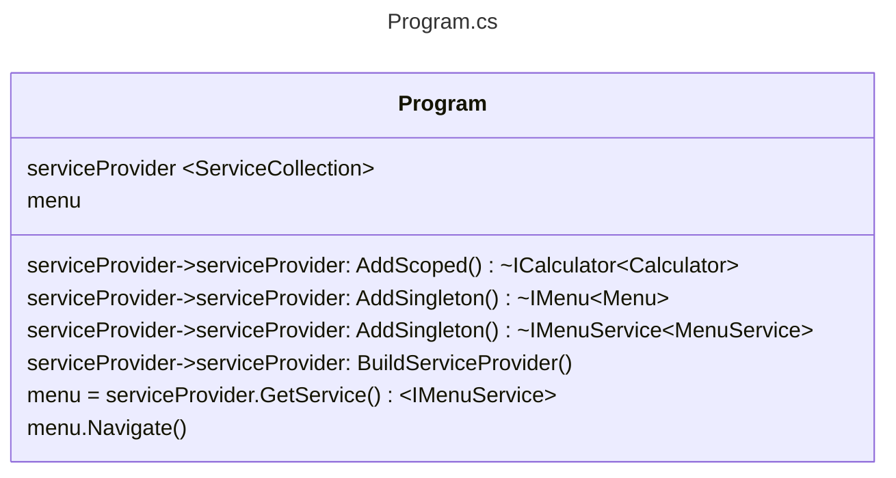

<h1>Model</h1>

```mermaid
---
title: Calculator.cs
---

classDiagram
    
     Calculator <|--  ICalculator
     graph LR
       class Calculator {
    Add(~decimal~ x,~decimal~ y) decimal
     Divide(~decimal~ x,~decimal~ y) decimal
     Multiply(~decimal~ x,~decimal~ y) decimal
     Subtract(~decimal~ x,~decimal~ y) decimal
    }  
      class ICalculator{
     Add(~decimal~ x,~decimal~ y) decimal
     Divide(~decimal~ x,~decimal~ y) decimal
     Multiply(~decimal~ x,~decimal~ y) decimal
     Subtract(~decimal~ x,~decimal~ y) decimal
    }
    

```
 
 
 
<!-- coment -->

```mermaid

 ---
title: Menu.cs
---
    
    classDiagram
    Menu <|-- IMenu
       
       class IMenu{
        IList~Options~ options
       }
        class Menu{
        IList~Options~ options
        Menu(~ICalculator~ calculator)
       }
       class Options{
        ~String~ Content
        ~Delegate~ MethodCalculation
        Options(~String~ content, ~Delegate~ methodCalculation)
       }

```

<h1>Services<h1>

```mermaid

 ---
title: MenuService.cs
---
    
    classDiagram
       
        MenuService <|-- IMenuService
        class MenuService{
            ~IMenu~ _menu
            MenuService(IMenu menu)
             Options() ~int~
            Navigate()
            AskNumbers()
       }
         class IMenuService{
            Navigate()
       }
      

```

<h1>Program<h1>

```mermaid

 ---
title: Program.cs
---
    
    classDiagram
       
        class Program{
                 serviceProvider ~ServiceCollection~
                 menu
                 serviceProvider->serviceProvider: AddScoped() ~ICalculator~Calculator~
                 serviceProvider->serviceProvider: AddSingleton() ~IMenu~Menu~
                 serviceProvider->serviceProvider: AddSingleton() ~IMenuService~MenuService~
                 serviceProvider->serviceProvider: BuildServiceProvider()
                 menu = serviceProvider.GetService() ~IMenuService~
                 menu.Navigate()

    

            
             
           
       }
     
      

```
